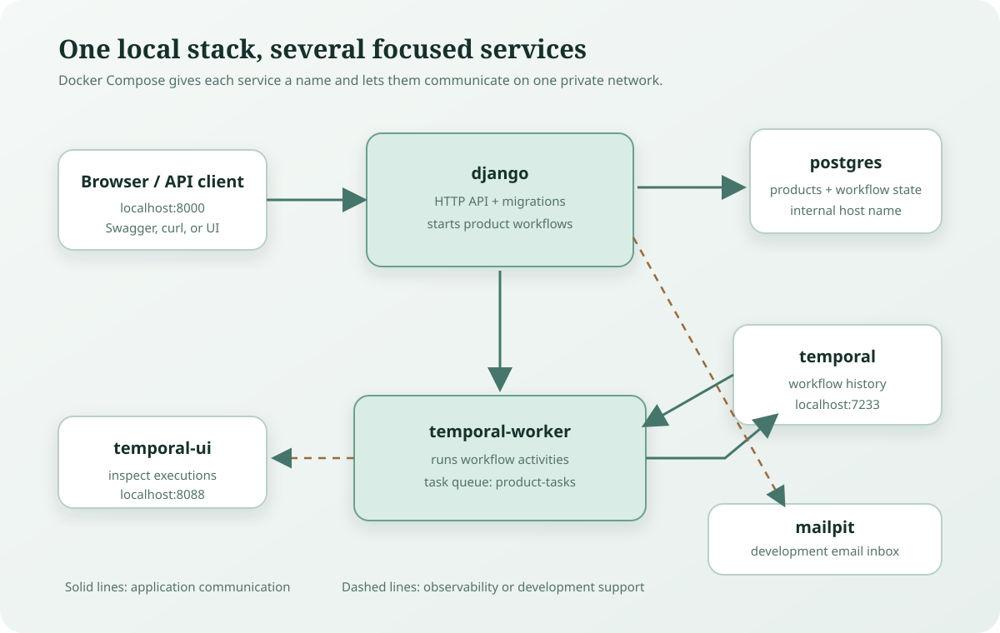
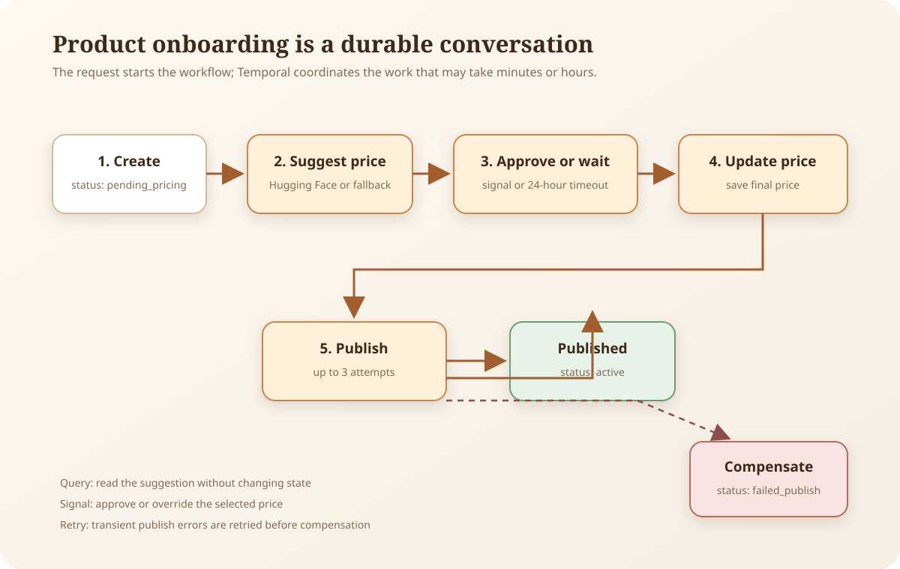

# Product Onboarding Platform

A Django application for managing products and running an asynchronous pricing and publishing workflow with [Temporal](https://temporal.io/).

The local development environment is containerized with Docker Compose and includes PostgreSQL, Temporal, the Temporal UI, and Mailpit. Product onboarding can use a Hugging Face price recommendation when configured, with a deterministic cost-based fallback for local development.



## Features

- Product and category management with Django and Django REST framework
- Authentication and user management with django-allauth
- Asynchronous product pricing and publishing with Temporal
- Human approval or automatic timeout for suggested prices
- Retry handling and compensation when publishing fails
- OpenAPI schema and interactive Swagger UI
- PostgreSQL-backed local development environment
- Pre-commit checks with Ruff, django-upgrade, pyproject-fmt, and djLint
- Mailpit for inspecting development email

## Technology Stack

- Python 3.14
- Django 6
- Django REST framework
- PostgreSQL
- Temporal Python SDK
- Docker Compose
- `uv` for Python dependency and lockfile management
- `just` for common development commands

## Quick Start

### Prerequisites

Install:

- [Docker Desktop](https://docs.docker.com/desktop/)
- [Git](https://git-scm.com/downloads)
- [`just`](https://github.com/casey/just)

Verify the tools:

```bash
docker --version
docker compose version
git --version
just --version
```

### Start the local stack

Clone the repository and start the services:

```bash
git clone <repository-url>
cd app
just up
```

The `justfile` selects `docker-compose.local.yml`. On startup, the Django container runs database migrations before starting the development server.

The main local services are available at:

| Service | URL |
| --- | --- |
| Django application | <http://localhost:8000> |
| API documentation | <http://localhost:8000/api/docs/> |
| Temporal UI | <http://localhost:8088> |
| Mailpit | <http://localhost:8025> |

Check service status and logs with:

```bash
docker compose ps
just logs django
just logs temporal-worker
```

The Temporal worker must be running for product workflows to execute.

### Local environment

Docker Compose reads local settings from:

```text
.envs/.local/.django
.envs/.local/.postgres
```

Use development-only credentials in these files and never commit production secrets. `HUGGINGFACEHUB_API_TOKEN` is optional. Without it, pricing uses a fallback based on product cost:

```text
suggested price = cost x 1.35
```

## Common Commands

The project uses [`just`](https://github.com/casey/just) as a small command runner. Run `just` to list available commands.

| Command | Purpose |
| --- | --- |
| `just build` | Build the local Docker images |
| `just up` | Start the local services in the background |
| `just down` | Stop the local services and keep volumes |
| `just prune` | Stop services and remove volumes, including database data |
| `just logs [service]` | Follow logs for all services or one service |
| `just manage <command>` | Run a Django management command in the container |
| `just pytest [path]` | Run pytest in the Django container |

Examples:

```bash
just manage createsuperuser
just manage showmigrations
just pytest
just pytest app/products/tests/test_workflow_activities.py
```

## Product Onboarding Workflow

Creating a product through the workflow API starts a Temporal workflow named `product-onboarding-{product_id}`. The workflow runs on the `product-tasks` task queue:

1. Save the product with `pending_pricing` status.
2. Calculate a market price using Hugging Face or the cost fallback.
3. Wait for a human approval signal or the configured timeout.
4. Save the selected price.
5. Publish the product with retries.
6. Mark the product `active`, or compensate by marking it `failed_publish` after exhausted retries.



The workflow-specific create endpoint is:

```text
POST /api/workflows/
```

After creating a product, inspect its pricing suggestion:

```text
GET /api/workflows/{product_id}/pricing-suggestion/
```

Approve or override the price:

```text
POST /api/workflows/{product_id}/approve-price/
```

Example request body:

```json
{
  "price": "129.99"
}
```

See [Tutorial](https://dev.to/maaddae/building-durable-ai-powered-workflows-in-django-2dga) for the complete walkthrough, including Docker Compose setup, authentication notes, Temporal UI inspection, retries, and the compensation path.

## API Documentation

When the local server is running:

- Swagger UI: <http://localhost:8000/api/docs/>
- OpenAPI schema: <http://localhost:8000/api/schema/>

The API is mounted below `/api/`. The product workflow endpoints require authentication.

## Quality Checks

Install the Git hook from inside the Django container:

```bash
docker compose run --rm django pre-commit install
```

Run all configured hooks:

```bash
docker compose run --rm django pre-commit run --all-files
```

The hook configuration is in `.pre-commit-config.yaml` and includes common file checks, Django upgrades, Ruff linting and formatting, `pyproject.toml` formatting, and Django template checks.

## Project Structure

```text
app/
|-- products/                  # Product models, API, views, tests, and workflows
|-- users/                     # User management and authentication integration
|-- templates/                 # Django templates
`-- static/                    # CSS, JavaScript, images, and fonts
config/
|-- settings/                  # Base, local, production, and test settings
|-- temporal_client.py         # Shared Temporal client manager
`-- temporal_worker.py         # Temporal worker entry point
docker-compose.local.yml       # Local Django, PostgreSQL, Temporal, and Mailpit stack
compose/local/                 # Local Docker startup configuration
justfile                       # Common development commands
pyproject.toml                 # Python project metadata and tool configuration
```

## Testing

Run the complete test suite inside Docker:

```bash
just pytest
```

Workflow activity tests can be run independently:

```bash
just pytest app/products/tests/test_workflow_activities.py
```

The test configuration uses `config.settings.test` and a reusable test database as configured in `pyproject.toml`.

## Contributing

1. Create a focused branch from the current development branch.
2. Start the local stack with `just up`.
3. Install and run the pre-commit hooks.
4. Add or update tests for behavior changes.
5. Run `just pytest` before opening a pull request.
6. Describe the change, verification steps, and any configuration requirements.

Please keep changes focused and do not commit secrets, generated static files, local databases, or environment-specific configuration.

## License

This project is licensed under the [MIT License](LICENSE).
